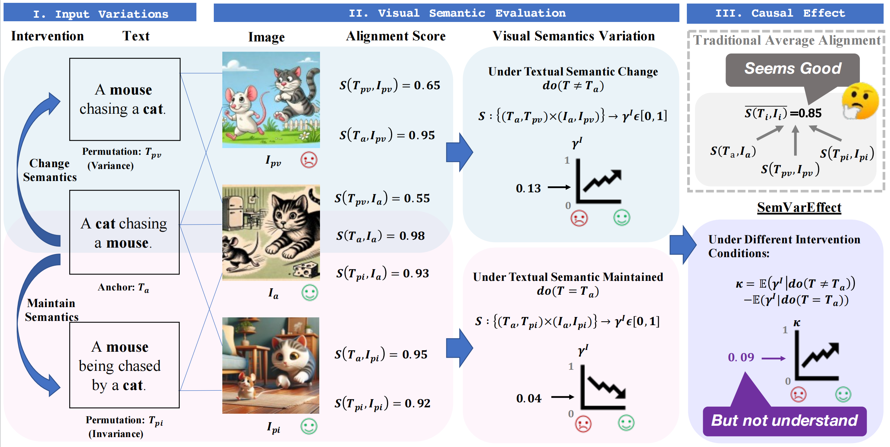

## Evaluating Semantic Variation in Text-to-Image Synthesis: A Causal Perspective

We propose a novel metric called **SemVarEffect** and a benchmark named **SemVarBench**, designed to evaluate the causality between semantic variations in inputs and outputs in T2I synthesis. 

This repository contains the official implementation of [SemVarBench](https://openreview.net/forum?id=NWb128pSCb) ([backup](https://arxiv.org/html/2410.10291v1)). 


>[**Evaluating Semantic Variation in Text-to-Image Synthesis: A Causal Perspective**](https://openreview.net/forum?id=NWb128pSCb)    
>[Xiangru Zhu](), 
>[Penglei Sun](), 
>[Yaoxian Song](),  
>[Yanghua Xiao](), 
>[Zhixu Li](), 
>[Chengyu Wang](), 
>[Jun Huang](), 
>[Bei Yang](),  
>[Xiaoxiao Xu](),
<br>**Fudan University, Hong Kong University of Science and Technology (Guangzhou), Zhejiang University, Renmin University of China, Alibaba Group**<br> 

<details>
    <summary>Click for full abstract</summary>
    Accurate interpretation and visualization of human instructions are crucial for text-to-image (T2I) synthesis. However, current models struggle to capture semantic variations from word order changes, and existing evaluations, relying on indirect metrics like text-image similarity, fail to reliably assess these challenges. This often obscures poor performance on complex or uncommon linguistic patterns by the focus on frequent word combinations. To address these deficiencies, we propose a novel metric called SemVarEffect and a benchmark named SemVarBench, designed to evaluate the causality between semantic variations in inputs and outputs in T2I synthesis. Semantic variations are achieved through two types of linguistic permutations, while avoiding easily predictable literal variations. Experiments reveal that the CogView-3-Plus and Ideogram 2 performed the best, achieving a score of 0.2/1. Semantic variations in object relations are less understood than attributes, scoring 0.07/1 compared to 0.17-0.19/1. We found that cross-modal alignment in UNet or Transformers plays a crucial role in handling semantic variations, a factor previously overlooked by a focus on textual encoders. Our work establishes an effective evaluation framework that advances the T2I synthesis community's exploration of human instruction understanding. 
</details>


<details>
    <summary>Click for full evaluation framework</summary>

<table class="center">
    <tr>
    <td width=100% style="border: none"></td>
    </tr>
    <tr>
    <td width="100%" style="border: none; text-align: center; word-wrap: break-word">Overview of the evaluation based on SemVarBench.
</td>
  </tr>
</table>

</details>


<!-- We propose a novel metric called (**SemVarEffect**)() and a benchmark named (**SemVarBench**)(), designed to evaluate the causality between semantic variations in inputs and outputs in T2I synthesis. -->


## 🚩 New Updates 

**[2023.10]** The previous work, the dataset of [Winoground-T2I](https://github.com/zhuxiangru/Winoground-T2I), released.

**[2024.10]** The training/test set of SemVarBench is released.

**[2025.02]** This paper has been accepted to the ICLR 2025.


**The SemVarBench benchmark can be found in the benchmark directory** ./SemVarBench/tree/main/benchmark/


## Citation 
If you find the data in our project useful, please consider citing our work as follows:
```
@article{zhu2024evaluating,
  title={Evaluating Semantic Variation in Text-to-Image Synthesis: A Causal Perspective},
  author={Zhu, Xiangru and Sun, Penglei and Song, Yaoxian and Xiao, Yanghua and Li, Zhixu and Wang, Chengyu and Huang, Jun and Yang, Bei and Xu, Xiaoxiao},
  journal={arXiv preprint arXiv:2410.10291},
  year={2024}
}
``` 
